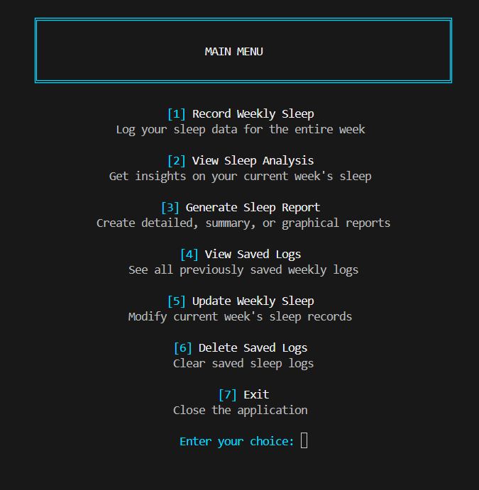
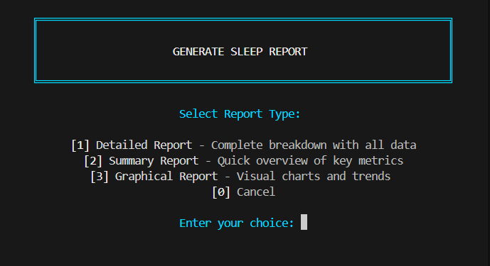
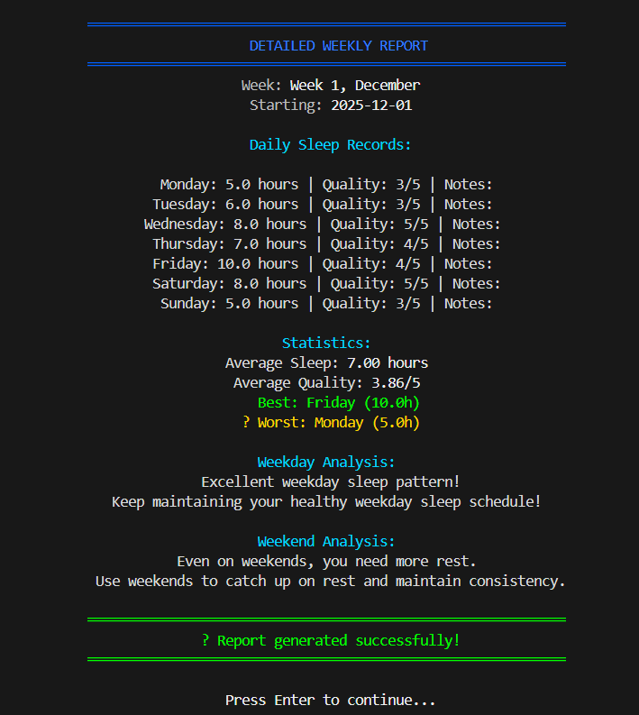
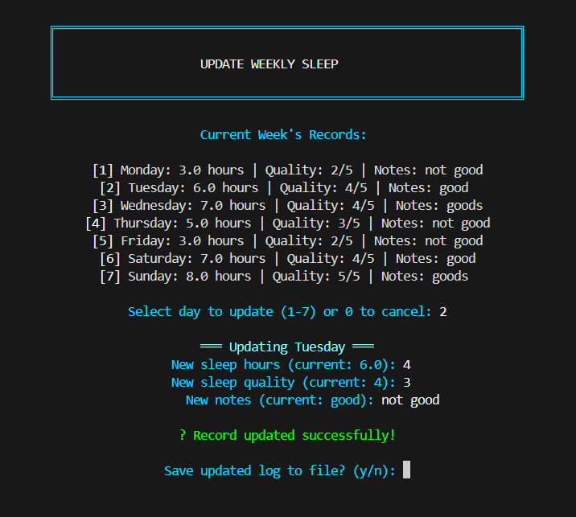
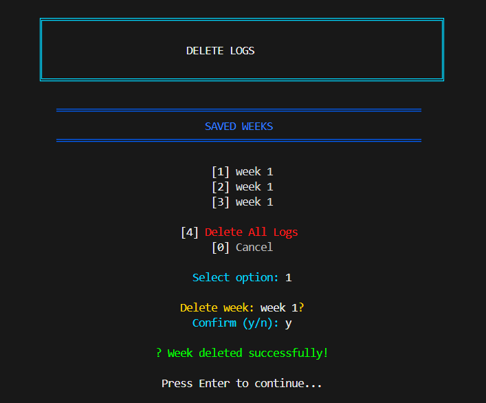
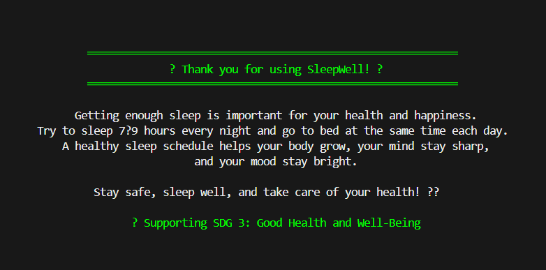

# ZENTRA: SleepSync Analyzer & Mind-Body Rebalance System

## OVERVIEW

  **Zentra: SleepSync Analyzer & Mind-Body Rebalance System** is a sleep-tracking app that helps users monitor, evaluate, and improve their sleep habits throughout the week. The system enables users to enter their daily sleep duration, rate their sleep quality from 1 to 5, and add optional notes for each day from Monday to Sunday. Using this information, the system calculates the user’s average sleep hours and overall sleep quality. It also identifies the days with the best and worst sleep performance and spots unhealthy patterns, such as consecutive days with less than six hours of sleep.

  The program separates weekday and weekend sleep behavior, allowing a more thorough analysis of the user’s sleep routine. Based on the collected data, the system gives personalized feedback that aligns with recommended sleep guidelines, especially the ideal range of 7 to 9 hours per night. To help with long-term tracking, all weekly logs are saved in a text file. This feature allows users to review past entries, fix any mistakes, or delete outdated data as needed. With these features, the system aims to encourage healthier sleep habits and promote overall mind-body well-being.

## OOP CONCEPTS APPLIED

  This section explains how the four fundamental Object-Oriented Programming (OOP) concepts, such as abstraction, inheritance, polymorphism, and encapsulation, were applied in the development of the SleepSync Analyzer. Each pillar is described in relation to its actual function and behavior in the program.

### 1. **Abstraction**

  Abstraction focuses on hiding complex implementation details while exposing only essential features to users. Our system implements abstraction through abstract classes that define contracts without providing complete implementations. The SleepAnalyzer abstract class specifies what sleep analyzers must do (analyze patterns and provide recommendations) without dictating how each analysis should be performed. This allows different analyzers to implement their own logic while maintaining a consistent interface. Similarly, the ReportGenerator abstract class defines what reports must generate without specifying the exact format or content. Beyond class design, abstraction is also present in higher-level components: the SleepLogFileManager class hides the complexities of file input/output operations, and the WeeklySleepLog class abstracts away intricate calculations for averages and pattern detection. This layered abstraction makes the system easier to understand, use, and maintain.

### 2. **INHERITANCE**

  Inheritance allows new classes to derive properties and behaviors from existing classes, promoting code reuse and logical hierarchy. Our system features two inheritance hierarchies. The first centers on the abstract SleepAnalyzer class, which defines a template for sleep analysis with abstract methods that must be implemented by subclasses. The WeekdayAnalyzer and WeekendAnalyzer classes extend this parent class, each providing specialized logic tailored to different days of the week. The second hierarchy begins with the abstract ReportGenerator class, which serves as a blueprint for different types of reports. Three subclasses—DetailedReport, SummaryReport, and GraphicalReport—extend this parent, each implementing unique ways to present sleep data. This structure eliminates code duplication and makes the system easily extensible for future enhancements.

### 3. **POLYMORPHISM**

  Polymorphism enables objects of different classes to be treated as objects of a common superclass, allowing one interface to represent different underlying forms. In our application, polymorphism is most evident in the reporting system. All report types inherit from ReportGenerator and override the `generateReport()` method with their own implementations. When the program calls this method, Java dynamically determines which version to execute based on the actual object type at runtime—whether it's a DetailedReport, SummaryReport, or GraphicalReport. Similarly, the sleep analyzer system uses polymorphism through the SleepAnalyzer superclass reference, which can point to either WeekdayAnalyzer or WeekendAnalyzer objects, with the correct analysis logic being invoked automatically. This design allows for flexible and dynamic behavior without requiring complex conditional logic.

### 4. **ENCAPSULATION**

  Encapsulation is the practice of bundling data with the methods that operate on that data while restricting direct access to some components. In our SleepSync Analyzer, encapsulation is implemented through the DailySleepRecord class, which acts as a protected container for daily sleep information. All data fields are kept private, and access is strictly controlled through public getter and setter methods. This approach ensures data integrity by validating all inputs before they are stored—for example, sleep hours must be between 0 and 24, and sleep quality must be rated between 1 and 5. The WeeklySleepLog class also uses encapsulation by keeping its collection of sleep records private while providing controlled public methods for adding records and performing calculations. This design prevents external code from accidentally corrupting data and makes the system more secure and maintainable.

## PROGRAM STUCTURE

**Main Class (Program Controller)**
  
  The Main class is the starting point of the program and controls everything the user does. It shows menus, takes user input, and guides them through recording sleep data, viewing reports, and managing saved logs. It also handles input validation to make sure users enter correct values. This class keeps a reference to the current weekly log and uses the SleepLogFileManager for saving and loading files. It also includes simple helper functions for cleaning the screen and formatting text.

**DailySleepRecord (One Day of Sleep Data) - Encapsulation**
  
  This class represents a single day’s sleep entry. It stores the day of the week, hours slept, sleep quality (1–5), and optional notes. All data is private, and validation ensures that sleep hours stay between 0–24 and ratings stay within the allowed range. It also includes a readable toString format for easy display. This class ensures each sleep entry is clean, valid, and consistent.

**WeeklySleepLog (Full Week of Records + Calculations) - Encapsulation**
  
  WeeklySleepLog stores seven DailySleepRecord objects and includes details such as the week label and start date. It calculates averages for sleep hours and sleep quality and identifies the best and worst sleep days. It can detect irregular patterns, such as multiple days of poor sleep or big differences in sleep duration. It also provides weekday and weekend analysis by filtering the data and sending it to the correct analyzer class. This class organizes and processes all sleep data for the week.

**analyzePattern and getRecommendation - Polymorphism**
  
  These methods share identical names and appear in both the WeekdayAnalyzer and WeekendAnalyzer classes. Although they use the same method attributes, they produce different outputs because each class were modified to implement commands aligned to its specific purpose.

**SleepAnalyzer (Abstract Analysis Blueprint) - Abstraction**
  
  SleepAnalyzer is an abstract class that defines the general structure for all sleep analysis. It includes two methods that every analyzer must implement: analyzePattern and getRecommendation. It also has a protected field for day type (weekday or weekend). This class cannot be used directly but provides a consistent framework for its child classes. It focuses on what analyzers must do, not how they do it.

**WeekdayAnalyzer (Weekday Sleep Interpretation) - Inheritance**
  
  This class analyzes weekday sleep using stricter standards. It checks if the user gets the recommended 7–9 hours and gives messages about whether the pattern is healthy or lacking. It also gives specific advice for improving weekday sleep, like maintaining consistency and avoiding undersleeping or oversleeping. It tailors feedback to the busy schedule of school or work days.

**WeekendAnalyzer (Weekend Sleep Interpretation) - Inheritance**
  
  WeekendAnalyzer evaluates sleep with more flexible standards (7–10 hours). It checks whether users are catching up on sleep debt from the week and warns against relying too much on weekend oversleeping. It encourages balanced sleep throughout the entire week. Its feedback is designed for the more relaxed nature of weekends.

**ReportGenerator (Abstract Reporting Framework) - Abstraction**
  
  The ReportGenerator abstract class defines the template for all report types in the system. It specifies that all reports must implement methods for report generation and format identification, creating a consistent interface for the polymorphic reporting system.

**DetailedReport (Comprehensive Output) - Inheritance**
  
  Extending ReportGenerator, DetailedReport produces thorough, text-based reports that include all sleep data, complete analysis, and detected patterns. It presents information in a comprehensive format suitable for detailed review and record-keeping.

**SummaryReport (Concise Overview) - Inheritance**
  
  Also extending ReportGenerator, SummaryReport generates brief, focused reports highlighting only key metrics and overall sleep status. This report type provides quick insights without extensive detail.

**GraphicalReport (Visual Representation) - Inheritance**
 
  Extending ReportGenerator, GraphicalReport creates visual reports using ASCII art representations including bar charts for sleep hours and star ratings for sleep quality. This report type offers intuitive visual analysis of sleep patterns.

**SleepLogFileManager (File Saving and Loading) - Data Storage**
  
  This class handles all file operations using the sleep_logs.txt file. It saves weekly logs, including daily records and analysis results, and can display all saved logs in a clear format. It can also delete a specific week's log or erase all saved data. By keeping all file-related tasks in one class, the program stays organized and easier to maintain. It also safely handles file errors to prevent crashes.

## HOW TO RUN THE PROGRAM

  To run the program from the command line, first verify that the Java Development Kit is installed by opening a terminal or command prompt and executing java -version and javac -version, which should both return a Java version.

**Menu Option 1: Record Weekly Sleep**
 
  Prompts the user to enter a week label and start date, then collects sleep data for all seven days of the week (hours, quality rating 1-5, and optional notes). After recording all days, the program offers to save the complete weekly log to a file.

**Menu Option 2: View Sleep Analysis**

  Displays a comprehensive analysis of the current week's recorded data, including average sleep hours and quality, best and worst sleep days, separate weekday and weekend analyses with recommendations, and any detected irregular patterns like consecutive low-sleep days or high variability.

**Menu Option 3: Generate Sleep Report** 
 
  Allows the user to create different formats of reports based on the current week's data. The user is presented with a sub-menu to choose between a Detailed Report (a complete breakdown of all data), a Summary Report (a quick overview of key metrics), or a Graphical Report (visual charts illustrating sleep hours and quality trends). The chosen report is then generated and displayed on the console.

**Menu Option 4: View Saved Logs**

  Reads and displays all previously saved weekly sleep logs from the file, showing each week's summary statistics, daily records, analyses, and irregular patterns in a formatted, color-coded layout.

**Menu Option 5: Update Weekly Sleep**

  Allows the user to modify existing records in the current week by selecting a specific day, entering new values for sleep hours, quality, and notes, with optional file saving after updates are complete.

**Menu Option 6: Delete Saved Logs**

  Provides options to either delete a specific week's log or delete all saved logs completely, with confirmation prompts before any deletion occurs to prevent accidental data loss.

**Menu Option 7: Exit**
 
  Displays a farewell message with sleep health tips and recommendations, references SDG 3 (Good Health and Well-Being), then closes the application and terminates the program.

## SAMPLE OUTPUT

### 1. Welcome page

  As the user runs the program, the welcome page will appear containing the title and prompting the user to continue by pressing the “Enter” key.

### 2.  Main  Menu: First, you have to choose between (1-6)

  Upon pressing the “Enter” key, the main menu will appear, prompting the user to select from the options depending on what function they want to explore. The function of each option will be presented on the screenshots of the following:

### 3. [1] Record Weekly Sleep

### 4. [2] View Sleep Analysis

### 5. [3] Generate Sleep Report:

### 5.1. [1] Detailed Report:

### 5.2. [2] Summary Report:

### 5.3. [3] Graphical Report:

### 6. [3] View Saved Logs

### 7. [4] Update Weekly Sleep

### 8. [5] Delete Saved Logs

### 9. [6] Exit

## ACKNOWLEDGEMENT

  First and foremost, we give thanks to **God** for guiding us, giving us strength, and granting us the patience and wisdom needed to accomplish this project. Without His blessings, this work would not have been possible.

  We would also like to express our sincere gratitude to **Mr. Jayson Abratique**, our instructor, for his continuous guidance, valuable insights, and unwavering support throughout the development of this project. His dedication and clear instructions greatly contributed to our understanding and completion of this work.

  We extend our appreciation to our classmates, friends, and loved ones, especially **Ms. Bianca Montalbo**, whose encouragement, assistance, and inspiration motivated us to improve our work and overcome challenges along the way. Their willingness to help made this project more manageable and meaningful.

  Lastly, we wholeheartedly thank our families for their constant support, understanding, and patience. Their encouragement provided us with the strength and determination to finish this project successfully.

## AUTHORS

**Vaughn Aia Gabriel V. Reyes**
**Justine Neilfred S. Ronquillo**
**Paul Ubert B. Rosal**
**Jiliane Pauleen T. Tagapan**

Bachelor of Science in Information Technology - 2103
College of Informatics and Computing Sciences
Batangas State University - The National Engineering University
